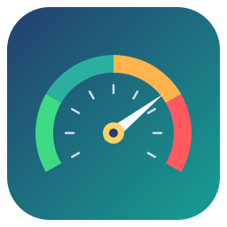
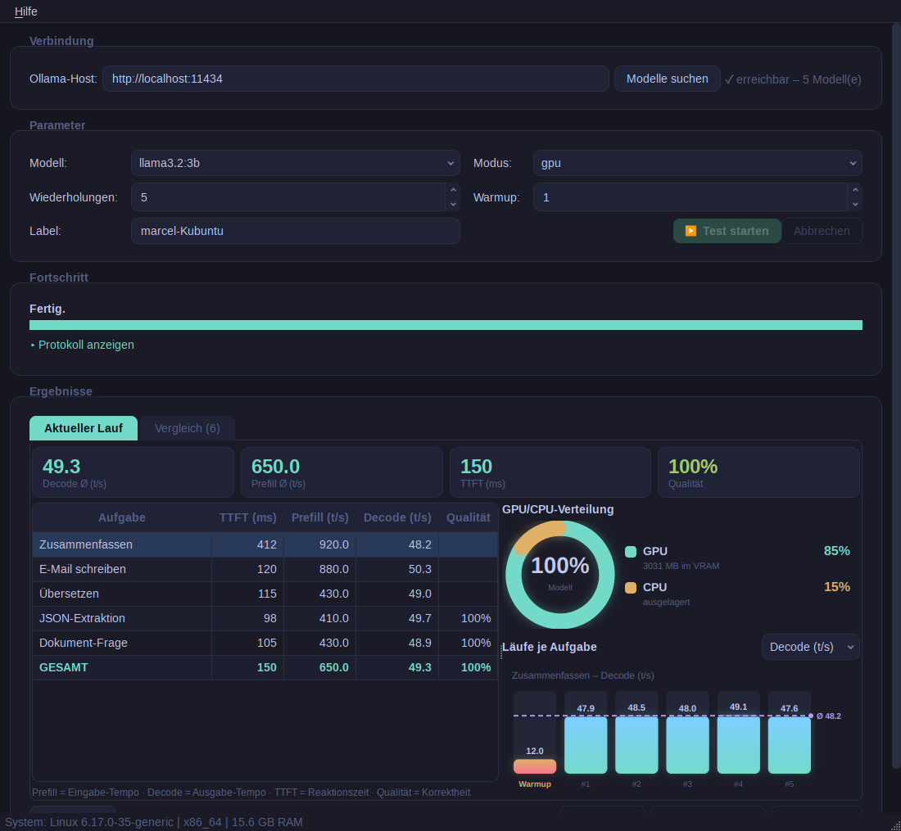
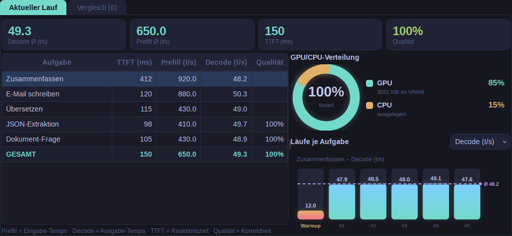
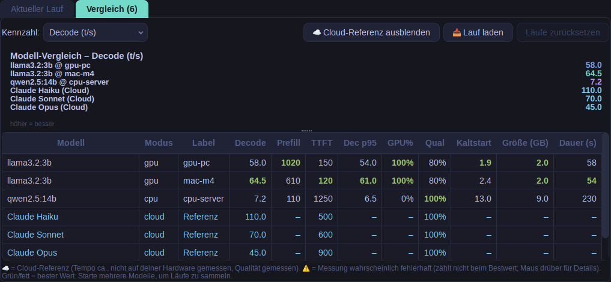
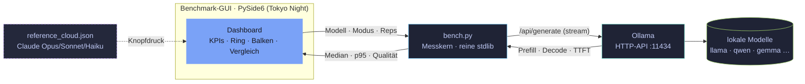

<div align="center">



# ⚡ Lokaler LLM-Benchmark

**Wie schnell läuft lokale KI auf _deiner_ Hardware – und wie weit bist du vom Frontier-Modell weg?**

Miss **Tempo, Speicher und Qualität** lokaler Sprachmodelle über [Ollama](https://ollama.com) –
als schickes Dashboard, mit **Modell-Vergleich** und **Cloud-Referenz**.
Hilft bei der Kaufentscheidung **16-GB-GPU-PC** · **Apple-Silicon-Mac** · **CPU + viel RAM**.

[](https://github.com/MarcelDIY/Benchmark/actions/workflows/build.yml)


</div>

---

<div align="center">



</div>

## Was ist das?

Lokale KI ist gratis und privat – aber **wie schnell** ist sie auf genau deinem Rechner?
Dieses Programm lässt dieselben **fünf Büro-Aufgaben** (Zusammenfassen, E-Mail, Übersetzen,
JSON-Extraktion, Dokument-Frage) durch ein lokales Modell laufen und misst reproduzierbar
**Prefill, Decode, Time-to-First-Token, Speicher-Verteilung und Qualität**.

> **Die zentrale Erkenntnis:** Genauigkeit hängt am **Modell + Quantisierung**, *nicht* an der
> Hardware. Damit reduziert sich die Hardware-Frage auf **Tempo + Preis + Speicher + Energie** –
> und genau die misst dieses Tool. So findest du heraus, ob ein **16-GB-GPU-PC**, ein
> **Apple-Silicon-Mac** oder schlicht **CPU + viel RAM** für deine Arbeit reicht.

Kern ist ein abhängigkeitsfreier Messläufer (`bench.py`, reine Python-Standardbibliothek);
darüber sitzt ein modernes **PySide6-Dashboard** im Tokyo-Night-Stil.

## ✨ Highlights

| | Feature | Worum es geht |
|---|---|---|
| **1** | **Schickes Dashboard** | KPI-Kacheln, Ringdiagramm (GPU/CPU-Verteilung) und Balken pro Lauf – als gestochen scharfe SVG-Grafiken. |
| **2** | **Modelle vergleichen** | Mehrere Modelle in einer Sitzung testen und im Reiter *Vergleich* nebeneinanderstellen – nach Decode, Prefill, TTFT, p95, Qualität, Kaltstart, Speicher, Dauer. Der **beste Wert je Kennzahl** ist grün/fett hervorgehoben (richtungsabhängig); unplausible Messungen werden mit ⚠ markiert und zählen nicht beim Bestwert. |
| **3** | **Läufe importieren** | Exportierte JSON-Ergebnisse – auch **von anderen Rechnern** – per *Lauf laden* in den Vergleich aufnehmen. So stehen GPU-PC, Mac und CPU-Server direkt nebeneinander. |
| **4** | **Cloud-Referenz** | Auf Knopfdruck Claude **Opus/Sonnet/Haiku** als Richtwert einblenden – damit du siehst, *wie weit du weg bist*. Ohne API-Key, ohne Kosten. |
| **5** | **Tatsächliche GPU/CPU-Verteilung** | Der Ring zeigt, wie viel des Modells real im VRAM lag (z. B. *85 % GPU / 15 % CPU*). |
| **6** | **Warmup sichtbar** | Der Kaltstart (Modell-Ladezeit) erscheint als eigener Balken – man sieht sofort, wie viel langsamer der erste Lauf ist. |
| **7** | **Standalone & lokal** | Reine stdlib-Messung, ein Doppelklick-Programm baubar (Win/macOS/Linux). Ollama bleibt die einzige externe Voraussetzung. |

## 📊 Das Dashboard

Pro Lauf: vier **KPI-Kacheln** für den Schnellüberblick, links die **Tabelle** je Aufgabe,
rechts der **GPU/CPU-Ring** und – für die in der Tabelle gewählte Aufgabe – die **Balken je Lauf**
mit Durchschnittslinie. Der orange Balken ganz links ist der **Warmup** (Kaltstart).



## 🆚 Modelle vergleichen + Cloud-Referenz

Starte mehrere Tests hintereinander (verschiedene Modelle/Modi) – im Reiter **Vergleich**
stehen sie nebeneinander. Die Kennzahl ist umschaltbar; der **beste Wert je Spalte** ist
grün/fett markiert (höher *oder* niedriger = besser, je nach Kennzahl). Per **Lauf laden**
holst du exportierte Ergebnisse anderer Rechner dazu, per Knopfdruck blendest du die
**Cloud-Referenz** (Claude Opus/Sonnet/Haiku, in Cyan) ein.



> ☁ **Cloud-Referenz:** Qualität echt gemessen (an den zwei prüfbaren Aufgaben, je 100 %);
> Tempo als **Richtwert** der Anbieter-Server – *nicht* auf deiner Hardware gemessen.
> Werte stehen in [`reference_cloud.json`](reference_cloud.json) und sind anpassbar.
> ⚠ markiert eine wahrscheinlich fehlerhafte Messung (z. B. Qualität 0 %); sie zählt nicht beim Bestwert.

## 🏗️ Wie es funktioniert



Die GUI ist nur ein Frontend: Sie ruft die Mess-Funktionen aus `bench.py` auf, die per
HTTP gegen Ollama streamen. Die Zahlen sind **identisch** zur Kommandozeile.

## 🧪 Die Mess-Aufgaben

Fünf typische Büro-Aufgaben, jede belastet gezielt einen Engpass:

| Aufgabe | Belastet | Qualitätsprüfung |
|---|---|---|
| **Zusammenfassen** (langes Protokoll) | Prefill (Eingabe-Verarbeitung) | – |
| **E-Mail schreiben** | Decode (lange Ausgabe) | – |
| **Übersetzen** (DE→EN) | gemischt | – |
| **JSON-Extraktion** | strukturierte Ausgabe | ✅ JSON-Schlüssel vorhanden |
| **Dokument-Frage** | Prefill + Genauigkeit | ✅ erwartete Antwort enthalten |

Volltext der Prompts: im Programm unter **Hilfe → Aufgaben** oder in [`tasks.json`](tasks.json).

## 📐 Die Kennzahlen

| Kennzahl | Bedeutung |
|---|---|
| **Decode** (t/s) | Ausgabe-Tempo – bandbreitenlastig, hier trennen sich GPU und Mac |
| **Prefill** (t/s) | Eingabe-Verarbeitung – rechenlastig, wichtig bei langen Texten |
| **TTFT** (ms) | Zeit bis zum ersten Token – die gefühlte Reaktionszeit |
| **Decode p95** | nahe Worst-Case – wie gleichmäßig schnell? |
| **Qualität** (%) | deterministischer Stichprobentest |
| **Kaltstart** (s) | Modell-Ladezeit (erster Lauf) |
| **Speicherbedarf** (GB) | Modellgröße – „passt es in den VRAM?" |
| **Gesamtdauer** (s) | wie lange der ganze Lauf dauert |
| **GPU-Anteil** (%) | wie viel des Modells real im VRAM lag |

Fair gemessen: `temperature 0`, fester Seed, feste Kontextlänge, **Median + p95** über mehrere
Läufe, Warmup, Cache-Buster für echte Prefill-Messung.

## 🚀 Schnellstart

**Voraussetzung:** [Ollama](https://ollama.com/download) installiert und gestartet, plus Python 3.9+.

### Grafische Oberfläche

**Schnellster Weg – Starter (legt `.venv` an und installiert PySide6 beim ersten Start):**

```bash
./start-linux.sh        # Linux **und** macOS (bash-Skript)
start-windows.bat       # Windows (Doppelklick)
```

**Oder manuell:**

```bash
python3 -m venv .venv
source .venv/bin/activate.fish          # fish; sonst: source .venv/bin/activate
pip install -r requirements.txt
python benchmark_gui.py
```

Dann: **Modelle suchen → Modell wählen → Test starten**. Mehrere Modelle nacheinander
für den Vergleich.

### Kommandozeile (ganz ohne Pakete)

```bash
python bench.py --label laptop-i9 --pull      # voller Lauf, fehlende Modelle laden
python bench.py --check                        # nur Setup prüfen
# Rechner im Netz messen (dort nur Ollama nötig):
OLLAMA_HOST=http://<ip>:11434 python3 bench.py --label bigpc --modes gpu
```

Ergebnisse landen in `results/` als `summary_*.md|csv` und `raw_*.csv`.

## 📦 Standalone bauen

Ein Doppelklick-Programm ohne installiertes Python.

**Fertige Binaries:** unter [**Releases**](../../releases) für **Windows, macOS (Intel + Apple Silicon) und Linux** –
automatisch von [GitHub Actions](.github/workflows/build.yml) gebaut. Ein Tag-Push (`v1.0`) erzeugt sie alle.

**Selbst bauen:** pro Betriebssystem separat (PyInstaller cross-kompiliert nicht):

| OS | Befehl | Ergebnis |
|---|---|---|
| Linux | `packaging/build-linux.sh` | `dist/BenchGUI/BenchGUI` |
| macOS | `packaging/build-macos.sh` | `dist/BenchGUI.app` |
| Windows | `packaging\build-windows.ps1` | `dist\BenchGUI\BenchGUI.exe` |

Details: [`docs/04-gui.md`](docs/04-gui.md). Ollama muss zur Laufzeit laufen.

> 🍎 macOS-Binaries sind **unsigniert** → Gatekeeper meckert beim Erststart.
> Freigeben mit Rechtsklick → *Öffnen* oder `xattr -dr com.apple.quarantine BenchGUI.app`.

## 🗂️ Projektstruktur

| Pfad | Zweck |
|---|---|
| `benchmark_gui.py` | PySide6-Dashboard (GUI) |
| `svgcharts.py` | Tokyo-Night-SVG-Diagramme (Ring, Balken, Vergleich) |
| `bench.py` | Messkern (reine stdlib, Prefill/Decode/TTFT/Qualität) |
| `tasks.json` | Modell-Liste + 5 Büro-Aufgaben |
| `reference_cloud.json` | Cloud-Referenz (Opus/Sonnet/Haiku) |
| `BenchGUI.spec` · `packaging/` | Standalone-Build |
| `tools/make_screenshots.py` | README-Screenshots reproduzierbar aus der GUI rendern |
| `tests/` | Unit-Tests (`python -m unittest discover -s tests`) |
| `docs/01–04` | Konzept · Recherche · Status · GUI/Bauen |

## 📄 Lizenz

[MIT](LICENSE) · © 2026 Marcel Räuber

<div align="center"><sub>Diagramm-Stil angelehnt an das Schwester-Projekt „Zweites Gehirn / ObsidianRAG".</sub></div>
